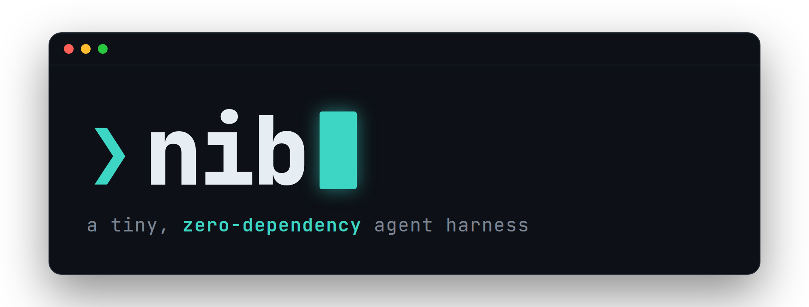
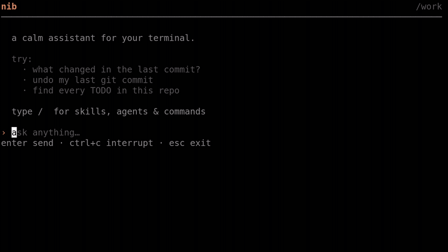
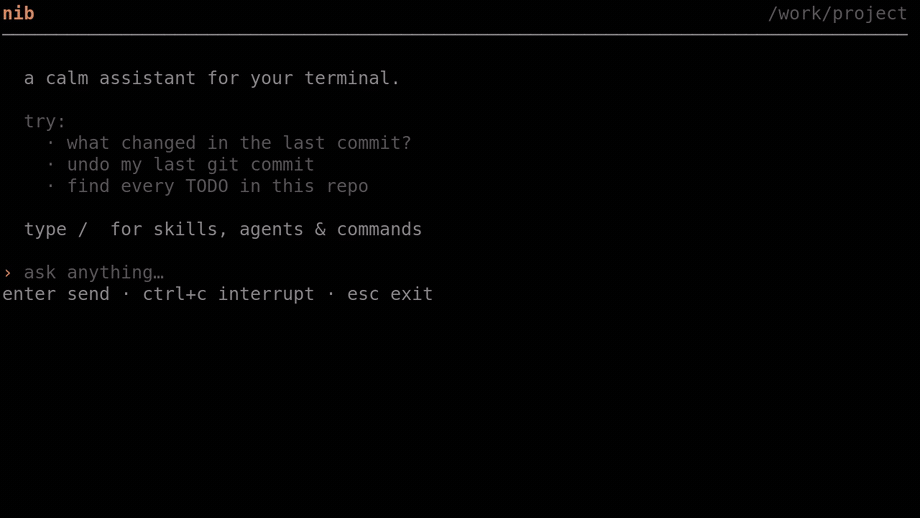

<h1 align="center">
  <br>
  
  <br>
</h1>

<p align="center">
  <b>A tiny, zero-dependency LLM agent harness that lives in your terminal.</b><br>
  One static binary. No runtime, no daemon, no cloud. Local-LLM friendly. Summon it anywhere with <code>Ctrl+Space</code>.
</p>

<p align="center">
  
  
  
  
</p>

<p align="center">
  <a href="#why-nib">Why nib</a> •
  <a href="#quickstart">Quickstart</a> •
  <a href="#usage">Usage</a> •
  <a href="#plugins">Plugins</a> •
  <a href="#skills">Skills</a> •
  <a href="#configuration">Configuration</a> •
  <a href="#tool-approval">Tool Approval</a>
</p>

<p align="center">
  
</p>

---

## Why nib

Most LLM coding agents are big: a Node/Python runtime, a pile of dependencies, a login, a
background service. **nib is the opposite.** It's a single ~20 MB Go binary you drop on any
machine — laptop, server, container, a box you SSH'd into — and it just runs. Point it at
any OpenAI-compatible endpoint (including a local model) and press `Ctrl+Space`.

Small doesn't mean toy. nib is a real agent harness:

- **Tool use with approval** — it runs shell commands, but every call passes an approval gate you control.
- **Sub-agents** — delegate self-contained subtasks (`explore`, `plan`, …) that run in the foreground or background.
- **MCP** — connect any [Model Context Protocol](https://modelcontextprotocol.io/) server for extra tools, local or remote, with one command (`nib mcp add`).
- **Plugins** — installable packages that add MCP servers, sub-agents, prompt fragments, skills, slash commands, and lifecycle hooks. **Claude Code plugins work too.**
- **Skills** — install skill packs (e.g. [`obra/superpowers`](https://github.com/obra/superpowers)) and let the agent load them on demand.

Think of it as the **`fzf` for LLMs**: portable, keyboard-driven, composable, and out of your way.

| | nib | typical agent CLIs |
|---|---|---|
| Install | one static binary | runtime + package tree |
| Dependencies | **zero** | many |
| Local LLMs | first-class | varies |
| Summon | `Ctrl+Space`, anywhere | launch a session |
| Extend | plugins · skills · MCP | varies |
| Footprint | ~20 MB | hundreds of MB |

## Features

- **`Ctrl+Space` anywhere** — summon nib straight from your shell prompt; inline like `fzf`, or a tmux split when you're in tmux.
- **Two modes** — a polished TUI, or a plain `--cli` mode for pipes and scripts.
- **Tool execution with approval** — the AI proposes commands; you approve, deny, edit, or trust for the session.
- **Sub-agents & background jobs** — delegate to typed sub-agents; background them (`Ctrl+B`) and watch the jobs footer (`Ctrl+J`).
- **Plugins** — `nib plugin install <git-url>`; six contribution types; Claude-Code-plugin compatible.
- **Skills** — `nib skill install <git-url>`; progressive-disclosure skill packs loaded on demand.
- **MCP protocol** — bring any external tool server.
- **tmux-native** — seamless splits and popups.
- **Multi-shell** — zsh, bash, and fish.
- **Zero dependencies** — one portable binary, trivial to install and upgrade.

## Quickstart

**1. Install**

```bash
curl -fsSL https://raw.githubusercontent.com/mudler/nib/master/install.sh | bash
```

<details>
<summary>Other ways to install</summary>

```bash
# zsh users
curl -fsSL https://raw.githubusercontent.com/mudler/nib/master/install.sh | zsh

# from source
git clone https://github.com/mudler/nib && cd nib && go build -o nib . && sudo mv nib /usr/local/bin/

# go install
go install github.com/mudler/nib@latest
```
</details>

**2. Configure** a model — `~/.config/nib/config.yaml`:

```yaml
model: gpt-4o-mini
api_key: your-api-key
base_url: https://api.openai.com/v1   # or your local endpoint, e.g. http://localhost:8080/v1
```

**3. Press `Ctrl+Space`** in your terminal (or just run `nib`). That's it.

## Usage

Run `nib` to open the TUI, or press `Ctrl+Space` from your shell. Use `--cli` for a plain,
pipe-friendly mode.

### Summon nib from your shell (`Ctrl+Space`)

The `install.sh` script wires this up for you. Inside tmux, nib opens in a split pane so it
never disturbs what you're doing:

<p align="center">
  
</p>

To wire it up manually, add the line for your shell:

```bash
eval "$(nib --init zsh)"      # ~/.zshrc
eval "$(nib --init bash)"     # ~/.bashrc
nib --init fish | source      # ~/.config/fish/config.fish
```

### Sub-agents & background jobs

Ask nib to delegate, and it spawns a typed sub-agent (`explore`, `plan`, or any you
configure). Background a running job with `Ctrl+B` and watch the jobs footer with `Ctrl+J`:

<p align="center">
  
</p>

### `/loop` — recurring & self-paced tasks

- `/loop 5m /foo` — run `/foo` (a slash command or prompt) every 5 minutes.
- `/loop /foo` — self-paced: the model runs `/foo`, then decides when to repeat
  by scheduling its own wake-ups; it stops when the task is done.
- `/loop list` — show active loops.
- `/loop stop [id]` — stop one loop, or all loops if no id is given.

Loops are session-only by default. The model can also schedule jobs directly
with the `cron`, `cron_list`, and `cron_delete` tools; `cron(durable: true)`
persists across restarts to `.nib/loops.json`.

### `/goal` — keep going until a goal is met

- `/goal <text>` — set a goal. nib keeps working and re-checks it every time
  the model would stop, only finishing when the model decides the goal is met
  (it calls a `goal_done` tool) or you stop it.
- `/goal` — show the current goal.
- `/goal clear` — clear it. Pressing `Ctrl+C` during pursuit also clears it.

Unlike `/loop`, `/goal` is not scheduling — there are no timers. It's an
in-turn "keep going" gate: the model self-judges progress and continues until
done. You can still chat and steer while a goal is being pursued. Goals are
session-only and single (setting a new one replaces the old).

## Plugins

A **plugin** is a single installable unit — a git repo (or local dir) with a
`nib-plugin.yaml` manifest — that can contribute any combination of:

| Contribution | What it adds |
|---|---|
| `mcp_servers` | external MCP tool servers |
| `agents` | typed sub-agents the agent can spawn |
| `prompt_fragments` | extra system-prompt text (inline or from a file) |
| `skills` | skills indexed in the prompt, loaded on demand |
| `commands` | slash commands, optionally routed through a sub-agent |
| `hooks` | shell commands bound to lifecycle events (e.g. `SessionStart`, `PreToolUse`) |

```bash
nib plugin install <git-url|local-path>   # [--ref <tag|branch>] [--yes]
nib plugin list
nib plugin enable|disable <name>
nib plugin update|remove <name>
```

Install prints a summary of what the plugin contributes and asks for confirmation
(`--yes` to skip). Plugins install **disabled** by default; a disabled plugin contributes
nothing, and every tool call still passes the approval gate at runtime.

A minimal `nib-plugin.yaml`:

```yaml
name: my-plugin
version: 1.0.0
description: adds a sub-agent and a slash command

agents:
  - name: researcher
    description: investigates a self-contained subtask
    system_prompt: You are a focused research sub-agent.
    tools: [bash]

commands:
  - name: review
    description: review the given input
    prompt: "Review the following: {{.Args}}"
    agent: researcher
```

**Claude Code compatible.** `nib plugin install` also installs an unmodified Claude Code
plugin (`.claude-plugin/` layout) or marketplace, mapping its `plugin.json`, `skills/`,
`commands/`, `agents/`, `hooks/`, and `.mcp.json` into nib's model.

See **[`examples/nib-plugin-demo`](examples/nib-plugin-demo)** for a reference plugin that
exercises all six contribution types.

## Skills

A **skill pack** is a git repo (or local dir) containing a `skills/<name>/SKILL.md`
collection — for example [`obra/superpowers`](https://github.com/obra/superpowers). nib
harvests every skill, indexes it (name + description) in the system prompt, and the agent
pulls in a skill's full instructions on demand via the `load_skill` tool — or you inject one
eagerly for the session with `/skill <name>`.

```bash
nib skill install <git-url|local-path>    # [--ref <tag|branch>] [--yes]
nib skill list
nib skill enable|disable <name>
nib skill update|remove <name>
```

Like plugins, skill packs install **disabled**; enable the ones you want with
`nib skill enable <name>`. Skill packs carry their bundled files, so a skill can `Read` or
run scripts from its own directory at runtime.

## Agent over MCP (`nib mcp`)

nib can expose its agent as an **MCP server** so an external program can drive it
headless — a voice client (owning the mic/speaker and speech-to-text/text-to-speech),
a chat frontend, an IDE extension, an automation script, anything that speaks MCP.
nib stays a pure-Go static binary; the consumer lives entirely outside it.

```bash
nib mcp                       # serve over stdio (default; the client launches nib)
nib mcp --http --addr :8090   # serve over streamable HTTP instead
```

The server exposes two tools and one notification:

- `converse(utterance)` — send a message to the agent; returns the **first** reply
  immediately (even while background work continues, `pending: true`), so turns stay
  responsive instead of blocking until a multi-step task finishes.
- `interrupt()` — cancel the current turn.
- `notifications/message` (logger `nib`, payload `kind: "reply" | "error"`) — replies
  produced *after* the synchronous `converse` (finished sub-agents / shell jobs,
  resumes) arrive here, carrying the same `turn` id.

After connecting, the client **must** call MCP `logging/setLevel` with level
`info` (or lower), or it will receive no `nib/reply` / `nib/error` notifications:
the server emits them at info/error level, and the SDK gates logging
notifications behind the level the client has set.

In this mode tool calls are auto-approved (there is no terminal to prompt at);
set `approval_mode: allowlist` + `allowed_tools` in your config to restrict it.

The server adds **no prompt of its own** — the agent uses your configured
`system_prompt` as usual. To tune behavior for a particular consumer (e.g. a voice
client that wants short, spoken replies and long work pushed to the background),
set that in your `system_prompt` (or ship it as a plugin `prompt_fragment`); the
server stays consumer-agnostic.

## Configuration

nib looks for config (in order) in `./.nib.yaml`, `$XDG_CONFIG_HOME/nib/config.yaml`,
`~/.config/nib/config.yaml`, `~/.nib.yaml`, then `/etc/nib/config.yaml`.

```yaml
# Required: your LLM (any OpenAI-compatible endpoint, local or remote)
model: gpt-4o-mini
api_key: your-api-key
base_url: https://api.openai.com/v1

# Optional: custom system prompt
prompt: |
  You are a calm, helpful terminal assistant...

# Optional: per-request metadata sent verbatim on every LLM request (the OpenAI
# "metadata" object). Backends such as LocalAI use it for per-request flags —
# e.g. disable a reasoning model's thinking:
metadata:
  enable_thinking: "false"

# Optional: OpenAI-standard reasoning effort, sent on every request as
# "reasoning_effort" ("none"/"low"/"medium"/"high"). Unlike metadata.enable_thinking,
# this works even when the model's chat template has no enable_thinking toggle
# (e.g. LFM2.5) — so it's the reliable way to turn a reasoning model's thinking off:
reasoning_effort: "none"

# Optional: agent behavior
agent_options:
  iterations: 10
  max_attempts: 3
  max_retries: 3
  force_reasoning: false

# Optional: tool-approval policy (default: prompt for every tool)
#   prompt    — ask before each tool call (default)
#   allowlist — auto-approve the tools in allowed_tools, prompt for the rest
#   auto      — approve every tool call without prompting
approval_mode: prompt
allowed_tools:
  - bash

# Optional: extra sub-agent types (general, explore, plan are built in)
agents:
  - name: researcher
    description: investigates a self-contained subtask
    system_prompt: You are a focused research sub-agent.
    tools: [bash]
    # Per-agent metadata overlays the global metadata above (per key):
    metadata:
      enable_thinking: "true"

# Optional: external MCP servers
mcp_servers:
  filesystem:
    command: npx
    args: ["-y", "@anthropic/mcp-filesystem", "/home/user"]
    env:
      FOO: bar
```

You can also configure the essentials via environment variables:

```bash
export MODEL=gpt-4o-mini
export API_KEY=your-api-key
export BASE_URL=https://api.openai.com/v1
```

To skip every approval prompt for a run ("yolo" mode), pass `--yolo` or set
`NIB_YOLO=1` — both force `approval_mode: auto` regardless of what the config
file says:

```bash
nib --yolo          # or: NIB_YOLO=1 nib
```

While it's active, nib shows it on screen: a `yolo` badge in the TUI header and
a one-line notice in the CLI banner.

## Tool Approval

When nib wants to run a command, you decide:

```
▏ bash wants to run
▏ $ df -h
▏
▏ [1] run it once
▏ [2] always allow `df …`  (this session)
▏ [3] yes to everything this turn
▏ [n] no · [e] edit
```

In the **TUI**, approval is a single keypress (no Enter):

- `1` — run this call once
- `2` — always allow, scoped: for a simple shell command this grants just that
  command prefix (`df …`); for anything compound — or any other tool — it grants
  the whole tool. Session-only; sub-agents share the allow list. A command that
  chains (`&&`, `;`, `|`, `$( )`, …) never rides a prefix grant. A prefix grant
  trusts everything that command can do with its arguments — grant prefixes
  you'd trust with any flags.
- `3` — allow **all** tool calls for the rest of this turn (handy after delegating
  a multi-step task)
- `n` / `Esc` — deny
- `e` — edit the call, then submit

(`y`/`a`/`A` still work as aliases for `1`/`2`/`3`.)

In the **CLI** (`--cli`) the prompt is line-based: type `y`, `a`, `all`, `n`, or a free-form
change, then Enter. To skip prompting entirely, set `approval_mode` / `allowed_tools` in
your config, or run with `--yolo` (env: `NIB_YOLO=1`) to auto-approve every tool call.

## MCP Servers

nib speaks the [Model Context Protocol](https://modelcontextprotocol.io/). A set of
tools is built in — `bash`, the filesystem tools (`read`, `write`, `edit`, `glob`,
`grep`), and the web tools (`web_fetch`, `web_search`); add any external server with
the `nib mcp` CLI or directly in your config.

### `nib mcp` CLI

The quickest way to register a server — local (stdio) or remote (HTTP/SSE):

```bash
# Local stdio server: everything after `--` is the command and its args.
nib mcp add filesystem --env API_KEY=secret -- npx -y @anthropic/mcp-filesystem /home/user

# Remote server over streamable HTTP (default) or SSE.
nib mcp add docs --url https://example.com/mcp
nib mcp add docs --url https://example.com/mcp --transport sse

nib mcp list             # show configured servers
nib mcp test docs        # connect, list the server's tools, exit nonzero on failure
nib mcp remove docs      # delete a server
```

`nib mcp add` writes to your user config; servers become available on the next nib
session. (The agent itself can also register servers mid-session via its
`add_mcp_server` tool.) Note `nib mcp` with no subcommand serves nib's *own* agent
over MCP — see [Agent over MCP](#agent-over-mcp-nib-mcp) above.

### Config

The CLI just edits the `mcp_servers` map; you can also write it by hand:

```yaml
mcp_servers:
  my_server:                  # local (stdio) server
    command: /path/to/mcp-server
    args: ["--some-flag"]
    env:
      API_KEY: secret
  remote_docs:                # remote server
    url: https://example.com/mcp
    transport: sse            # "http" (default) or "sse"
```

## tmux

Inside tmux, nib automatically uses a split pane for the TUI. Pass `--no-tmux` to disable.

## License

MIT
