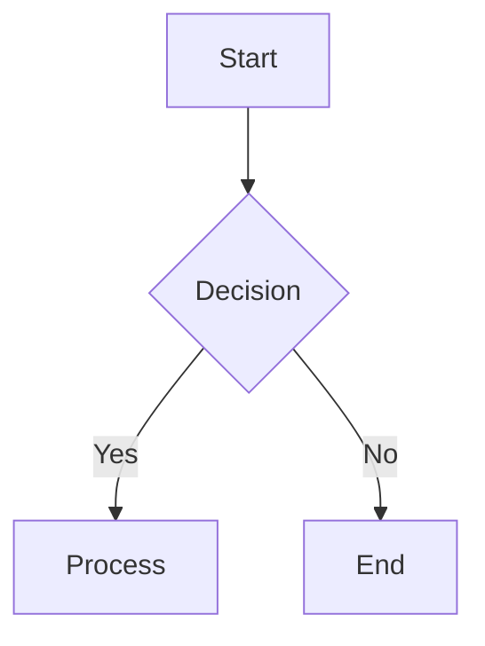

# Spec: Inline terminal image rendering + syntax highlighting + Mermaid fallback

## Motivation

nib's model-side vision is solid (computer_use, browser_vision, read_image) but the
user never sees what the model sees. Screenshots, captured images, and attached photos
appear as `[image content (image/png), 12345 bytes]`. Code blocks render in a single
dim color. Mermaid diagrams show as raw source.

This spec closes that gap:
1. **Inline image rendering** — render tool-produced and user-attached images inline
   using kitty graphics protocol and iTerm2 inline images.
2. **Syntax highlighting** — replace the single dim code-block color with per-language
   chroma styles.
3. **Mermaid fallback** — detect `mermaid` code fences in markdown and render a
   placeholder with node count instead of raw source. Full ASCII art is a follow-up.

## Scope

### In scope
- Kitty graphics protocol: transmit-once + placement (no unicode placeholders)
- iTerm2 inline images (OSC 1337)
- Terminal detection via env vars (no DA1 queries)
- Image budget (cap concurrent live images, demote oldest to text)
- Plumb image bytes from cogito ToolStatus.ResultData → TUI render layer
- Image sources: computer_use, browser_vision, read_image/read_video (raw file bytes),
  user attachments, future generate_image
- Syntax highlighting via glamour's chroma integration
- Mermaid fence detection + placeholder

### Out of scope
- Sixel (needs a Go encoder or cgo; can be added later)
- Half-block / truecolor rendering (complex, low value for common terminals)
- Kitty unicode placeholders for cell-accurate placement (transmit+place is enough;
  placeholders can come later for reflow stability)
- Full Mermaid ASCII art parser (ship placeholder first, parser is a follow-up)
- OSC 8 hyperlinks, OSC 66 text sizing, DECCARA fills

## Design

### New package: `tui/termimg/`

#### `detect.go` — terminal capability detection

Env-var based detection (no DA1 queries — avoids hanging on pipes that don't respond):

| Env var | Protocol |
|---|---|
| `KITTY_WINDOW_ID` | Kitty |
| `GHOSTTY_RESOURCES_DIR` | Kitty |
| `ITERM_SESSION_ID` | iTerm2 |
| `WEZTERM_PANE` | Kitty |
| `TERM_PROGRAM=WezTerm` | Kitty |
| (none matched) | None (text fallback) |

Override via `NIB_IMAGE_PROTOCOL=kitty|iterm2|off`.

```go
type Protocol int

const (
    ProtocolNone Protocol = iota
    ProtocolKitty
    ProtocolITerm2
)

func Detect() Protocol
```

#### `kitty.go` — Kitty graphics protocol encoder

Kitty graphics protocol uses APC (Application Program Command) escape sequences.

Transmit (send image data once, terminal stores it by ID):
```
\x1b_Ga=t,f=100,q=2,i=<imageID>,m=1;<base64-chunk>\x1b\\
\x1b_Ga=t,f=100,q=2,i=<imageID>,m=0;<base64-chunk>\x1b\\
```
- `a=t` — transmit action
- `f=100` — PNG format
- `q=2` — suppress response
- `i=<id>` — image ID (stable across frames)
- `m=1` — more chunks follow; `m=0` — last chunk
- Base64 data split into ≤4096-byte chunks

Place (display a previously transmitted image at cursor position):
```
\x1b_Ga=p,i=<imageID>,c=<cols>,r=<rows>,q=2\x1b\\
```
- `a=p` — place action
- `c=<cols>`, `r=<rows>` — cell dimensions for the placement

Delete (purge image from terminal store):
```
\x1b_Ga=d,d=I,i=<imageID>,q=2\x1b\\
```
- `a=d,d=I` — delete image + all placements

```go
func encodeKittyTransmit(data []byte, imageID int) string
func encodeKittyPlace(imageID, cols, rows int) string
func encodeKittyDelete(imageID int) string
```

Images must be PNG for kitty (`f=100`). Non-PNG images are converted before encoding.
The conversion happens in the render layer before calling encode.

#### `iterm2.go` — iTerm2 inline image encoder

OSC 1337 inline image:
```
\x1b]1337;File=inline=1;width=<cols>;height=<rows>:<base64>\x07
```

```go
func encodeITerm2(data []byte, mime string, cols, rows int) string
```

iTerm2 re-emits the full sequence on every frame. The base64 payload is larger but
iTerm2 handles it fine. No transmit-once state needed.

#### `manager.go` — image budget + transmit state

```go
type ImageRef struct {
    ID       int    // stable ID for kitty transmit tracking
    Data     []byte // raw image bytes (PNG-encoded for kitty)
    MIME     string
    Source   string // "computer_use", "browser_vision", "read_image", "attachment"
}

type ImageManager struct {
    protocol Protocol
    nextID   int
    // transmitted tracks which image IDs have been sent to the terminal
    // (kitty only — iTerm2 has no transmit state)
    transmitted map[int]bool
    // budget: max concurrent live images; oldest demoted to text
    budget      int
    // displayOrder tracks render-pass ordering for budget eviction
    displayOrder []int
}

func NewImageManager() *ImageManager

// RenderImage returns the escape sequence for an image.
// On first render with kitty: emits transmit + place.
// On subsequent renders with kitty: emits place only.
// With iTerm2: always emits the full inline sequence.
// Returns "" when the image was demoted (text fallback).
func (m *ImageManager) RenderImage(ref ImageRef, cols, rows int) string

// PurgeAll deletes all transmitted kitty images (call on exit).
func (m *ImageManager) PurgeAll() string
```

**Budget logic** (default max 8 concurrent images):
- Each render pass calls `Observe(imageID)` for every visible image, in display order.
- After the pass, images beyond the budget are demoted: their kitty IDs are purged
  (`encodeKittyDelete`) and they render as text `[Image: WxH]`.
- Demoted images reserve their height (blank lines) so the transcript doesn't collapse.

### Modified: `chat/callbacks.go` — carry image data in ToolResult

```go
type ToolImage struct {
    Data []byte // raw image bytes
    MIME string // "image/png", "image/jpeg", etc.
}

type ToolResult struct {
    Name      string
    Result    string
    Arguments string
    AgentID   string
    Change    *FileChange
    Images    []ToolImage // NEW — populated when the tool produced image content
}
```

### Modified: `chat/session.go` — extract images from cogito result

In `WithToolCallResultCallback` (around line 1628-1647), after `recordExternalResult`,
extract `mcp.ImageContent` from `status.ResultData` (which is `*mcp.CallToolResult`).

The extraction mirrors cogito's `imagesFromResultData` (toolimages.go) but carries raw
bytes instead of building data-URI strings:

```go
func extractToolImages(resultData any) []ToolImage {
    res, ok := resultData.(*mcp.CallToolResult)
    if !ok || res == nil {
        return nil
    }
    var out []ToolImage
    for _, c := range res.Content {
        if img, ok := c.(*mcp.ImageContent); ok && len(img.Data) > 0 {
            mime := img.MIMEType
            if mime == "" {
                mime = "image/png"
            }
            out = append(out, ToolImage{Data: img.Data, MIME: mime})
        }
    }
    return out
}
```

Then in the callback:
```go
s.callbacks.OnToolResult(ToolResult{
    Name:      status.Name,
    Result:    status.Result,
    Arguments: argsJSON,
    AgentID:   s.agentLogs.agentFor(status.ToolArguments.ID),
    Change:    change,
    Images:    extractToolImages(status.ResultData), // NEW
})
```

This does NOT change what cogito does — cogito still forwards images to the model
via `appendToolImages`. We're just also carrying the bytes to the TUI.

### Modified: `tui/model.go` — ChatMessage carries images

```go
type ChatMessage struct {
    // ... existing fields ...
    Images []chat.ToolImage // NEW — for inline rendering
}
```

`toolMessage()` populates `Images` from `res.Images`.

For user attachments: `sendWithAttachmentsCmd` populates `Images` on the user
`ChatMessage` when an attachment is an image (Kind == PartImage with data URI, or
a file path that resolves to an image).

For `read_image`/`read_video`: the specialist client reads the file to send to the
vision model. We add the raw file bytes to `ToolResult.Images` alongside the text
description. This requires `mediatools.go` to return the raw bytes in addition to the
description text.

### Modified: `tui/render/viewstate.go` — Message carries image refs

```go
type ImageRef struct {
    ID     int    // stable render ID (hash of toolCallId + index)
    Data   []byte // raw bytes (PNG-encoded for kitty)
    MIME   string
    Source string
}

type Message struct {
    // ... existing fields ...
    Images []ImageRef // NEW
}
```

### Modified: `tui/render/tool.go` — render images in tool block

`ToolBlock()` appends image sequences below the tool body when `m.Images` is non-empty.

For each image:
1. Resize if needed (cap longest side at ~1024px for performance; use
   `golang.org/x/image/draw` for Lanczos resampling)
2. Convert to PNG if kitty (kitty requires `f=100` = PNG)
3. Call `ImageManager.RenderImage(ref, cols, rows)` — returns escape sequence or ""
4. If "" (demoted), render text placeholder `[Image: WxH]`
5. Reserve height with blank lines so scrollback doesn't collapse

The `Model` holds the `*termimg.ImageManager` and passes it through the presenter to
`ToolBlock()`. On `tea.Quit`, the model calls `PurgeAll()` and writes the result to
stdout (purge all kitty image IDs from the terminal store).

### Modified: `tui/markdown.go` — syntax highlighting via chroma

Glamour v1.0.0 already has full chroma integration. The `ansi.StyleCodeBlock`
struct has a `Chroma *ansi.Chroma` field. When `Chroma` is non-nil and the color
profile is not Ascii, glamour registers the chroma style entries and calls
`quick.Highlight(iw, e.Code, e.Language, formatter, theme)` for code blocks
(verified in `glamour@v1.0.0/ansi/codeblock.go:86-128`).

The `ansi.Chroma` struct (`glamour@v1.0.0/ansi/style.go:4-36`) has a
`StylePrimitive` for each token type: `Text`, `Comment`, `Keyword`,
`KeywordType`, `Name`, `NameFunction`, `NameBuiltin`, `NameClass`,
`Literal`, `LiteralNumber`, `LiteralString`, `LiteralStringEscape`,
`Operator`, `Punctuation`, `Background`, etc.

The current `nibMarkdownStyle()` sets `CodeBlock` to a single `Color: &dim`.
The fix: populate the `Chroma` field with theme-matched `StylePrimitive` entries:

```go
CodeBlock: ansi.StyleCodeBlock{
    StyleBlock: ansi.StyleBlock{
        StylePrimitive: ansi.StylePrimitive{Margin: &zero},
    },
    Chroma: &ansi.Chroma{
        Text:      ansi.StylePrimitive{Color: &fg},
        Comment:    ansi.StylePrimitive{Color: &dim, Italic: &yes},
        Keyword:    ansi.StylePrimitive{Color: &accent, Bold: &yes},
        KeywordType: ansi.StylePrimitive{Color: &accent},
        Name:       ansi.StylePrimitive{Color: &fg},
        NameFunction: ansi.StylePrimitive{Color: &accent},
        NameBuiltin: ansi.StylePrimitive{Color: &accent},
        NameClass:   ansi.StylePrimitive{Color: &accent},
        Literal:     ansi.StylePrimitive{Color: &fg},
        LiteralNumber: ansi.StylePrimitive{Color: strPtr("#d1aff0")},
        LiteralString: ansi.StylePrimitive{Color: strPtr("#a6e3a1")},
        LiteralStringEscape: ansi.StylePrimitive{Color: &dim},
        Operator:   ansi.StylePrimitive{Color: &dim},
        Punctuation: ansi.StylePrimitive{Color: &dim},
        Background:  ansi.StylePrimitive{},
    },
},
```

Colors derive from nib's `theme` package: `accent` for keywords/functions/types,
`dim` for comments/operators/punctuation, a green-tinted hue for strings, a
purple-tinted hue for numbers. The existing `mdRenderers` cache and
`mdCacheLimit` remain unchanged — chroma highlighting is per-render, not per-cache.

No new dependencies needed — chroma v2 is already an indirect dep via glamour.

### Modified: `tui/markdown.go` — Mermaid fence detection

In the markdown rendering pipeline, detect `` ```mermaid `` fences. Replace the raw
source with a one-line placeholder:

```
[Mermaid diagram — N nodes]
```

Node count is a rough heuristic: count lines that look like node declarations
(`-->`, `---`, `->>`, lines starting with a letter/word followed by `[`, `(`, `{`).

Full ASCII art rendering is a follow-up that needs a Mermaid parser. This placeholder
is better than raw source because it tells the user what was there without flooding the
transcript with diagram syntax.

Implementation: pre-process the markdown string before passing to glamour. Scan for
`` ```mermaid\n `` fences, extract the content between the fence markers, count
approximate nodes, replace with the placeholder text wrapped in a plain code fence.

Example input:
``````markdown

``````

Becomes:
```markdown
```text
[Mermaid diagram — 4 nodes]
```
```

This keeps the block visually distinct (code fence) without dumping raw Mermaid syntax.

## Implementation plan

### Phase 1: Terminal image rendering infrastructure

1. Create `tui/termimg/` package: `detect.go`, `kitty.go`, `iterm2.go`, `manager.go`
2. Write unit tests for encoders (verify escape sequence format)
3. Write unit tests for detection (env var matrix)

### Phase 2: Plumb image data through the pipeline

4. Add `ToolImage` to `chat/callbacks.go`, `Images` field to `ToolResult`
5. Add `extractToolImages` in `chat/session.go`, wire into OnToolResult callback
6. Add `Images` to `ChatMessage` in `tui/model.go`, populate in `toolMessage()`
7. Add `Images` to `render.Message` in `tui/render/viewstate.go`
8. Add image rendering to `ToolBlock()` in `tui/render/tool.go`
9. Wire `ImageManager` into `Model`, call `PurgeAll()` on exit
10. Write integration test: tool result with image → ChatMessage carries images →
    render.Message carries image refs

### Phase 3: Image sources

11. Verify computer_use images flow through (already extracted from ResultData)
12. Verify browser_vision images flow through (same path)
13. Add raw file bytes to `read_image`/`read_video` results (`chat/mediatools.go`)
14. Add user attachment images to `ChatMessage.Images` in `sendWithAttachmentsCmd`

### Phase 4: Syntax highlighting

15. Determine glamour v1.0.0 chroma API (read glamour source / try options)
16. Configure chroma styles matching nib's theme
17. Update `nibMarkdownStyle()` to use chroma for code blocks
18. Test: code blocks in multiple languages render with per-token colors

### Phase 5: Mermaid placeholder

19. Pre-process markdown for mermaid fences before glamour
20. Replace with node-count placeholder
21. Test: mermaid fence → placeholder, not raw source

### Phase 6: Polish + ship

22. Image budget eviction logic (cap 8, demote oldest)
23. Image resize (cap longest side 1024px) for performance
24. PNG conversion for non-PNG images when kitty protocol
25. Manual test in kitty, Ghostty, iTerm2, unsupported terminal
26. Run full test suite, fix regressions
27. Commit, push, open PR

## Risks and mitigations

| Risk | Mitigation |
|---|---|
| Glamour v1.0.0 chroma API may differ from docs | Read glamour source first; fall back to builtin theme |
| Kitty transmit state leaks on crash | PurgeAll on exit; best-effort — terminals GC images on close |
| Large images slow rendering | Resize to 1024px max; image budget caps count |
| Image bytes in ChatMessage bloat memory | Budget caps live images; transcript history is already text-heavy |
| Non-PNG images need conversion for kitty | Use `image/png` encoder from stdlib |
| bubbletea re-renders entire view each frame | Kitty transmit-once means only placement sequences on re-render |

## Testing

- Unit tests for `termimg` encoders (verify exact escape sequence bytes)
- Unit tests for `termimg.Detect()` (env var matrix)
- Unit test for `extractToolImages` (mock `*mcp.CallToolResult` with ImageContent)
- Integration test: tool result → ChatMessage.Images → render.Message.Images
- Existing test suite must pass (no regressions in tool rendering, markdown, diffs)
- Manual test: run in kitty with computer_use, verify screenshot appears inline
- Manual test: run in terminal with no protocol, verify text fallback
